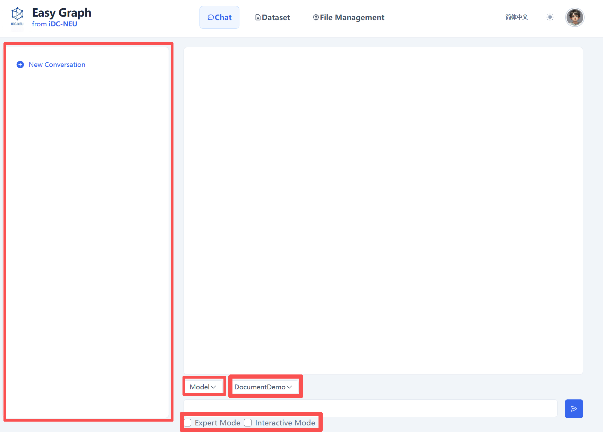
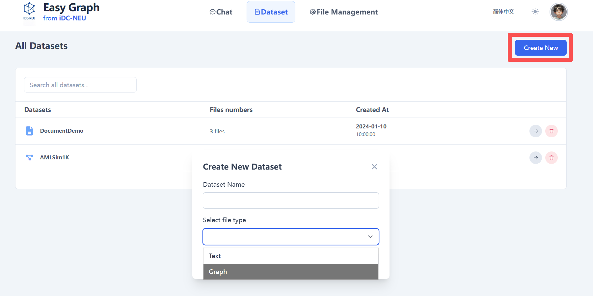
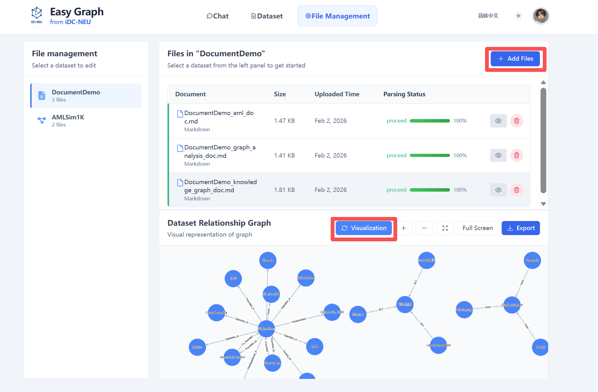
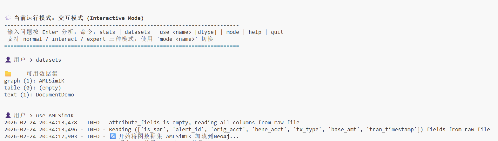

# AAG Installation and Usage Guide

This document introduces the environment preparation, installation steps, configuration methods, and basic usage of the **AAG** project.

------------------------------------------------------------------------

## 1. Environment Preparation

### 1.1 Python Version Requirements

-   Python &gt;= **3.11**

Please confirm that your current Python version meets the requirements:

``` bash
python --version
# or
python3 --version
```

### 1.2 Create Virtual Environment with Conda (Recommended)

``` bash
conda create -n AAG python=3.11
conda activate AAG
```

### 1.3 Neo4j Installation and Configuration

AAG requires Neo4j as the graph database. This guide uses **Neo4j 3.5.25**.

#### 1.3.1 Java Version Requirements

Neo4j 3.5.25 requires Java 8 or Java 11. Please check your Java version:

``` bash
java -version
```

If Java is not installed, please install the appropriate version first.

#### 1.3.2 Download and Extract Neo4j

1. Download the Neo4j 3.5.25 installation package from the official website (usually in `.tar.gz` or `.zip` format)
2. Extract the package to your desired location:

**Linux/Mac systems (.tar.gz format):**
``` bash
tar -xzf neo4j-community-3.5.25-unix.tar.gz
cd neo4j-community-3.5.25
```

**Windows systems (.zip format):**
- Right-click the archive and select "Extract to current folder"
- Or use command: `unzip neo4j-community-3.5.25-windows.zip`
- Navigate to the extracted directory

#### 1.3.3 Configure Neo4j

Enter the `conf` directory and edit the `neo4j.conf` file with the following configurations:

``` bash
cd conf
```

Add or modify the following settings in `neo4j.conf`:

``` properties
dbms.connectors.default_listen_address=0.0.0.0
dbms.connectors.default_advertised_address=localhost
dbms.connector.bolt.listen_address=0.0.0.0:7687
dbms.connector.http.listen_address=0.0.0.0:7474
dbms.connector.https.enabled=true
```

#### 1.3.4 Start and Stop Neo4j

Navigate to the `bin` directory to start or stop Neo4j:

**Start Neo4j:**
``` bash
cd bin
./neo4j start
```

**Stop Neo4j:**
``` bash
./neo4j stop
```

After starting Neo4j, you can access the web interface at `http://localhost:7474` to verify the installation.

------------------------------------------------------------------------

## 2. Get Source Code and Install Dependencies

### 2.1 Download Source Code

``` bash
git clone https://github.com/superccy/AAG.git
cd AAG
```

### 2.2 Install Dependencies

``` bash
pip install -r requirements.txt
```

------------------------------------------------------------------------

## 3. Configure System Parameters

### 3.1 Configure Inference and Retrieval Engine

Edit the configuration file:

``` text
config/engine_config.yaml
```

Example configuration:

``` yaml
# Running mode: interactive / batch
mode: interactive

# Reasoner module configuration
reasoner:
  llm:
    provider: "openai"   # Options: ollama / openai
    openai:
      base_url: "https://your-api-endpoint/v1/"
      api_key: "your-api-key"
      model: "gpt-4o-mini"

# Retrieval module configuration
retrieval:
  database:
    graph:
      space_name: "AMLSim1K"
      server_ip: "127.0.0.1"
      server_port: "9669"
    vector:
      collection_name: "graphllm_collection"
      host: "localhost"
      port: 19530
  embedding:
    model_name: "BAAI/bge-large-en-v1.5"
    device: "cuda:2"
  rag:
    graph:
      k_hop: 2
    vector:
      k_similarity: 5
```

------------------------------------------------------------------------

### 3.2 Configure Dataset

Edit the configuration file:

``` text
config/data_upload_config.yaml
```

Example configuration:

``` yaml
datasets:
  - name: AMLSim1K
    type: graph
    schema:
      vertex:
        - type: account
          path: "/path/to/accounts.csv"
          format: csv
          id_field: acct_id
      edge:
        - type: transfer
          path: "/path/to/transactions.csv"
          format: csv
          source_field: orig_acct
          target_field: bene_acct
```

> Please modify the `path` to your local actual data file path.

------------------------------------------------------------------------

## 4. Start AAG

> **Important Note:** Before starting AAG, please ensure that the Neo4j database is already running. If Neo4j is not started, AAG will not be able to connect to the graph database. Please refer to [1.3.4 Start and Stop Neo4j](#134-start-and-stop-neo4j) to start Neo4j.

AAG supports the following two running modes:

- **Web Interactive Mode (Recommended)**  
  Interactive analysis through a browser, suitable for daily use, demonstrations, and business analysis scenarios.

- **Terminal Interactive Mode**  
  Interaction through command line, suitable for development debugging, quick verification, and batch testing scenarios.

---

### 4.1 Web Interactive Mode

Execute the following command in the project root directory to start the web service:

```bash
python web/frontend/run.py
```
After successful startup, the terminal will output the accessible service address.
Please open the corresponding address in your browser according to the prompt to enter the AAG web interface.

In the web interface, users can input business questions in natural language, and the system will automatically complete the analysis process and display analysis results and reports.

#### Web Interface Usage Guide



Basic steps for using the AAG web interface for analysis:

1. **Start Conversation**: Start a new conversation or select an existing conversation from history.

2. **Select Mode**: Choose the mode that best suits your needs.

3. **Select Dataset**: The system will list your uploaded datasets. For example: DocumentDemo.

4. **Enter Your Request**: Type your instructions or questions in the input box. Please be as clear and specific as possible.

5. **Submit**: Click the send button.

6. **Monitor Progress**: Observe status updates in the main chat area (Running, Planning, Analyzing, etc.).

7. **View Results**: After processing is complete, results will be displayed in the main chat area. You can then ask follow-up questions or start a new request.

#### Dataset Management



In the web interface, you can conveniently manage datasets:

1. **Create Dataset**: Click the "Create New" button.

2. **Fill in Dataset Information**:
   - Enter the dataset name
   - Select the file type for the dataset

3. **Upload Data Files**: Upload corresponding data files based on the selected file type.

4. **Save Dataset**: After completing the configuration, save it. The dataset will be available for selection in conversations.

#### File Management



In the file management interface, you can manage and visualize files in datasets:

1. **Select Dataset**: Choose the corresponding dataset from the dropdown list.

2. **Upload Files**: Upload files to the selected dataset.

3. **View Parsing Progress**: The system will display file parsing progress and provide real-time status feedback.

4. **Visualize Knowledge Graph**: After file parsing is complete, click the "Visualization" button to view the knowledge graph visualization for that dataset.


### 4.2 Terminal Interactive Mode

If you want to interact with AAG directly through the command line, execute in the project root directory:

```bash
python aag/main.py
```
After startup, the system will enter terminal interactive mode.
Users can input questions according to terminal prompts, and AAG will complete the analysis and output results in the command line.



#### Terminal Interactive Usage Guide

Basic steps for using terminal interactive mode:

1. **View Available Datasets**: Use commands to view available datasets in the system.

2. **Select Dataset**: Select the dataset you want to use according to the prompts.

3. **Enter Questions**: Directly input your business questions or analysis requirements in the terminal.

4. **View Results**: The system will display the analysis process and final results in real-time in the terminal.

This mode is mainly used for development debugging, algorithm verification, or quick testing scenarios.

------------------------------------------------------------------------

## 5. Using AAG

Regardless of whether you use Web mode or Terminal mode, the basic usage process of AAG is consistent:

- Start the corresponding running mode

- Input natural language business questions according to prompts

- The system automatically completes task understanding, analysis execution, and result generation

For more advanced features, parameter descriptions, and usage examples, please refer to the project's README documentation or operation prompts in the interface.

------------------------------------------------------------------------

## 6. Common Issues and Suggestions

-   **GPU device unavailable**: Please confirm that `embedding.device` is set correctly
-   **Port conflict**: Check if graph database and vector database services are started
-   **Model cannot be loaded**: Confirm that API Key and model name are valid

------------------------------------------------------------------------

For batch mode, more model configurations, or advanced usage, please further consult the official documentation or source code comments.
